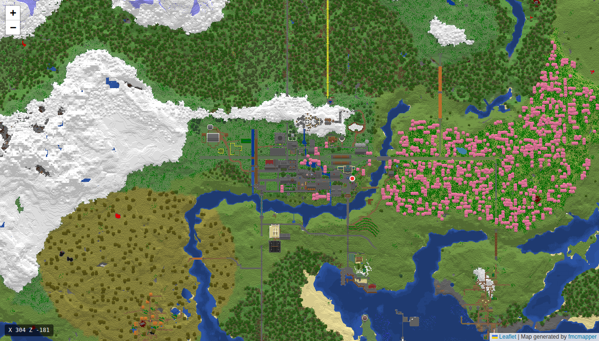

# fmcmapper

**fmcmapper** turns your Minecraft world into a zoomable, lightweight
Google-Maps-style web map you can open in any browser. It reads the world
straight from disk, renders a top-down image of every explored area, and keeps
it up to date as your world grows.



- 🗺️ Pan and zoom around your whole world in the browser, like Google Maps
- 🎨 Styled after Minecraft's **in-game map item** — same top-down view, block colours, and height shading
- 🌳 Biome-accurate grass, foliage, leaf-litter, and water tints
- 📍 Optional **live player positions** (requires multiplayer server + RCON)
- 🖱️ Display the coordinates + biome when hovering over the map
- ⚡ Incremental — only re-renders the parts of the world that changed
- 🔄 Runs continuously, refreshing the map every few minutes
- 🐳 Ships as a ready-to-run Docker image

The map is just static files (images + a web page) — the single fmcmapper
container renders them and serves them straight to your browser.

**▶ [Try the live demo](https://freekbes.github.io/fmcmapper/)** — a rendered
example world you can pan and zoom, no setup required.

---

## Contents

- [Beginner: run the whole thing with Docker](#beginner-run-the-whole-thing-with-docker)
- [Beginner: run on singleplayer worlds](#beginner-run-on-singleplayer-worlds)
- [Advanced: configuration & existing servers](#advanced-configuration--existing-servers)
- [Development: building from source](#development-building-from-source)

---

## Beginner: run the whole thing with Docker

This is the easiest path. You'll get **two things running together**:

1. **A Minecraft server** (your game world).
2. **fmcmapper** — watches the world, renders the map, and serves it to your browser at `http://<your-server>:8080`.

You don't need to know any code. You just need Docker.

### What is Docker?

Docker runs software in self-contained "containers" so you don't have to install
Node.js, Java, or anything else by hand — everything the program needs comes
bundled. **Docker Compose** lets you describe several containers in one file and
start them all with a single command. That file is already written for you.

### Step 1 — Install Docker

Install **Docker Desktop** (Windows/macOS) or **Docker Engine** (Linux) by
following the official guide: <https://docs.docker.com/get-docker/>. When it's
working, this command prints a version number:

```
docker --version
```

### Step 2 — Create the compose file

Make a fresh, empty folder and, inside it, create a file named
`docker-compose.yml` with this content:

```yaml
services:
  # The Minecraft server itself (provided by itzg/minecraft-server).
  mcserver:
    image: itzg/minecraft-server
    container_name: mcserver
    restart: "unless-stopped"
    ports:
      - "25565:25565"
    environment:
      EULA: "TRUE"
      TYPE: "VANILLA"
      VERSION: "26.2"          # keep this matching the fmcmapper tag below
    volumes:
      - ./mcserver:/data

  # The map renderer + web viewer (this project): renders the world and serves
  # the map to your browser on port 8080.
  fmcmapper:
    image: ghcr.io/freekbes/fmcmapper:26.2  # keep this matching the Minecraft version above
    pull_policy: always
    container_name: fmcmapper
    restart: "unless-stopped"
    ports:
      - "8080:80"            # open the map at http://localhost:8080
    environment:
      RENDER_INTERVAL: "5"   # re-render every 5 minutes
    volumes:
      - ./mcserver/world:/app/world:ro
      - ./mcserver/fmcmapper:/app/output
    depends_on:
      mcserver:
        condition: service_healthy
```

The Minecraft version is set to `26.2` in **two** places above — keep them the
same so the map's colours match your server's blocks.

You can bump both to a newer Minecraft version when one releases, **but
fmcmapper may not support it yet**: if no `fmcmapper` image has been built for
that version, the pull will fail. In that case you can use
`ghcr.io/freekbes/fmcmapper:latest` for the renderer — just be aware `latest` is
the newest build and may be untested against your version (colours could be off
or it may misbehave).

### Step 3 — Start everything

Within the same folder as your `docker-compose.yml`, run:

```
docker compose up -d
```

`-d` means "run in the background". The first start downloads the images and
generates a fresh Minecraft world, so give it a minute.

### Step 4 — Open the map

Go to **`http://localhost:8080`** in your browser (or `http://<server-ip>:8080`
if it's running on another machine). Until the first render finishes you'll see a
"rendering in progress" page that refreshes itself; then the map appears and
fills in as the server generates and saves chunks.

The map refreshes automatically **every 5 minutes**. To stop everything (run in the same folder as the compose file):

```
docker compose down
```

### What this sets up

| Service     | What it is                                   | Port    |
|-------------|----------------------------------------------|---------|
| `mcserver`  | A vanilla Minecraft server                   | `25565` |
| `fmcmapper` | Renders the map and serves it (this project) | `8080`  |

A `mcserver/` folder appears next to your compose file — that's your world and
server files. By using this compose file you accept the
[Minecraft EULA](https://aka.ms/MinecraftEULA) (it's set to `TRUE` in the file).

The Minecraft server part isn't ours — it's the excellent
[**itzg/minecraft-server**](https://github.com/itzg/docker-minecraft-server)
image. It handles running the server, EULA, version, mods, and much more. If you
want to change the Minecraft version, switch to Paper/Fabric/Forge, add plugins,
or tune the server, see its [documentation](https://docker-minecraft-server.readthedocs.io/).
fmcmapper only reads the world it produces.

> **That's all a beginner needs.** The sections below are optional.

---

## Beginner: run on singleplayer worlds

Yes, this works with singleplayer worlds too. Follow the steps above, but use
the following docker-compose file instead of the one above:

```yaml
services:
  fmcmapper:
    image: ghcr.io/freekbes/fmcmapper:latest  # optionally change latest to your Minecraft version
    pull_policy: always
    container_name: fmcmapper
    restart: "unless-stopped"
    ports:
      - "8080:80"            # open the map at http://localhost:8080
    environment:
      RENDER_INTERVAL: "5"   # re-render every 5 minutes
    volumes:
      - "/path/to/your/world:/app/world:ro"
      - "./output:/app/output"
```

You can find the path to your singleplayer world in the Minecraft launcher under
`Installations → <your profile> → More Options → Game Directory`. The world is
in `saves/` under that directory. Point the first `volumes` path to it — on
Windows use **forward slashes** and quote the whole entry, e.g.
`"C:/Users/YourName/AppData/Roaming/.minecraft/saves/My World:/app/world:ro"`.

---

## Advanced: configuration & existing servers

### Use fmcmapper with a server you already run

You don't have to use the bundled Minecraft server. Point fmcmapper at any
world folder on disk. The minimal piece is the `fmcmapper` service:

```yaml
services:
  fmcmapper:
    image: ghcr.io/freekbes/fmcmapper:26.2  # change 26.2 to your Minecraft version
    pull_policy: always
    ports:
      - "8080:80"                   # the map in your browser
    environment:
      RENDER_INTERVAL: "5"          # re-render every 5 minutes
    volumes:
      - /path/to/your/world:/app/world:ro   # your world (read-only)
      - /path/to/output:/app/output         # where the map is written
```

That single container renders the world *and* serves the map: a built-in nginx
hosts the `output` folder on port 80 — with cache revalidation (so the map
refreshes as the world changes without serving stale tiles), gzip, and the
live-player WebSocket reverse-proxied at `/players`. Just publish the port and
open `http://localhost:8080`.

> ⚠️ **Match the Minecraft version.** The image tag (`:26.2`) is the Minecraft
> version its colours were built for. If your world is a *different* version,
> fmcmapper still renders, but some block/biome colours may be slightly off and
> it prints a warning on startup. Use the image tag that matches your server,
> or regenerate the colour tables (see [Custom colour tables](#custom-colour-tables)).

### Show live players on the map (optional)

fmcmapper can show online players' **live positions** on the map. When RCON is
configured, the `fmcmapper` service polls your server over
[RCON](https://minecraft.wiki/w/RCON) every few seconds (`/list` + each player's `Pos`)
and serves the positions on a WebSocket; the viewer connects to it automatically
and shows a labelled dot per player. It's entirely opt-in — with no RCON
configured nothing runs and the map is unchanged. No extra container needed.

**1. Enable RCON on your Minecraft server.** With itzg/minecraft-server, add to
the `mcserver` environment:

```yaml
    environment:
      ENABLE_RCON: "true"
      RCON_PASSWORD: "changeme"        # pick your own
      RCON_PORT: "25575"
```

**2. Point fmcmapper at RCON.** Add to the existing `fmcmapper` service:

```yaml
    environment:
      RCON_HOST: "mcserver"            # must match your local server IP/hostname
      RCON_PORT: "25575"
      RCON_PASSWORD: "changeme"        # must match the server above
      # PLAYERS_POLL_INTERVAL: "2"     # seconds between polls (default 2)
```

**3. Restart the stack** so fmcmapper picks up the new env vars and the viewer
starts displaying players.

### Environment variables

| Variable          | Default                | What it does                                                        |
|-------------------|------------------------|---------------------------------------------------------------------|
| `WORLD_PATH`      | `./world`              | Path to the world folder to render.                                 |
| `OUTPUT_PATH`     | `./output`             | Where the map (tiles + `index.html`) is written.                    |
| `DIMENSION`       | `minecraft:overworld`  | Which dimension to map (`minecraft:the_nether`, `minecraft:the_end`, or a modded id). |
| `RENDER_INTERVAL` | *(unset)*              | Minutes between renders. **Unset = render once and exit.** Set it to run as a service. |
| `TILER_JOBS`      | half your CPU cores    | How many regions to render in parallel.                             |
| `TILER_FULL`      | `0`                    | Set to `1` to force a full redraw instead of an incremental one.    |
| `SERVE_ONLY`      | `0`                    | Set to `1` to **only serve** the existing `OUTPUT_PATH` and never render. Lets you keep serving a finished map after deleting the world to save disk; no world is read and live players are off. |

The same values can be passed as command-line arguments instead of env vars:
`world` `dimension` `output`, e.g. `… /app/world minecraft:the_nether /app/out`.

**Render once instead of continuously** — add the `--once` flag (overrides
`RENDER_INTERVAL`). Handy for a manual one-off against the running service:

```
docker compose run --rm fmcmapper --once
```

### Map appearance (optional tuning)

These tweak how the map looks. All are optional.

| Variable                  | Default | Effect                                              |
|---------------------------|---------|-----------------------------------------------------|
| `MAP_BRIGHTNESS`          | `1`     | Overall brightness (1 = unchanged, <1 darker).      |
| `MAP_FOLIAGE_BRIGHTNESS`  | `0.55`  | Darkening applied to leaves.                        |
| `MAP_GRASS_BRIGHTNESS`    | `0.8`   | Darkening applied to grass.                         |
| `MAP_DRY_FOLIAGE_BRIGHTNESS` | `0.8`  | Darkening applied to leaf litter (dry-foliage tint).|
| `MAP_WATER_BRIGHTNESS`    | `0.7`   | Darkening applied to water.                         |
| `MAP_BIOME_BLEND`         | `2`     | Biome colour blend radius (like in-game Biome Blend); `0` disables. |

### Custom colour tables

fmcmapper colours blocks using bundled `map_colors.json` and `biome_colors.json`
tables generated for a specific Minecraft version. If you run a different
version (or want exact colours), you can regenerate them with the companion
**map-color-dump** mod and point fmcmapper at the results with `MAP_COLORS_PATH`
and `BIOME_COLORS_PATH`. See [`MapColorDumpMod/README.md`](MapColorDumpMod/README.md).

### Image tags

Images are published to the GitHub Container Registry and tagged by the
Minecraft version they target:

- `ghcr.io/freekbes/fmcmapper:26.2` — newest build for Minecraft 26.2 *(use this)*
- `ghcr.io/freekbes/fmcmapper:26.2-<n>` — a specific immutable build, for rollback
- `ghcr.io/freekbes/fmcmapper:latest` — newest build overall

With `pull_policy: always`, `docker compose up` re-pulls the moving `:26.2` tag,
so you always get the latest render code without editing anything.

### Health check

The container reports **healthy** once the viewer is online, so other
services can wait for it (via `depends_on`) before starting.

---

## Development: building from source

### Run it locally with Node.js

Requires Node.js 24+.

```
npm install
npm run build          # compile TypeScript -> build/
npm start              # render: reads WORLD_PATH/OUTPUT_PATH or ./world -> ./output
```

Regenerate just the viewer page from an existing render:

```
npm run viewer         # uses OUTPUT_PATH or ./output
```

### Run from source with Docker Compose

Two compose files in the repo **build from your local checkout** instead of
pulling the published images — use them while developing:

- [`docker-compose.dev.yml`](docker-compose.dev.yml) — the full stack (Minecraft
  server + fmcmapper, which renders and serves the map), with `fmcmapper` built
  from this repo's `Dockerfile`. The same beginner setup, but local-built:

  ```
  docker compose -f docker-compose.dev.yml up --build
  ```

- [`docker-compose.dump.yml`](docker-compose.dump.yml) — builds the
  **map-color-dump** mod from `MapColorDumpMod/` and writes fresh
  `map_colors.json` / `biome_colors.json` into `assets/`. Run this to regenerate
  the colour tables (e.g. for a new Minecraft version):

  ```
  docker compose -f docker-compose.dump.yml up --build
  ```

  See [`MapColorDumpMod/README.md`](MapColorDumpMod/README.md) for details.

### Project structure

| Path                       | What it is                                              |
|----------------------------|---------------------------------------------------------|
| `src/buildtiles.ts`        | Entry point — region discovery, scheduling, tile pyramid. |
| `src/worker.ts`            | Renders one region to an image (runs in worker threads). |
| `src/chunkmap.ts`          | Block/biome → colour logic.                              |
| `src/viewer.ts`            | Generates the Leaflet `index.html`.                      |
| `src/players.ts`           | Live player tracking (RCON poll + WebSocket server).     |
| `src/biomevector.ts`       | Builds the biome polygons for the hover tooltip layer.   |
| `src/renderconfig.ts`      | Resolves the `MAP_*` appearance env vars and defaults.   |
| `src/container/`           | Image runtime: nginx config, entrypoint, loading page.   |
| `Dockerfile`               | Builds the fmcmapper image (renderer + built-in nginx).  |
| `assets/`                  | Bundled `map_colors.json` / `biome_colors.json`.         |
| `MapColorDumpMod/`         | Companion Fabric mod that generates colour tables. [README](MapColorDumpMod/README.md). |

### Contributing

To contribute, fork the repo, make your changes, and open a pull request. See
[CONTRIBUTING.md](CONTRIBUTING.md) for details.
